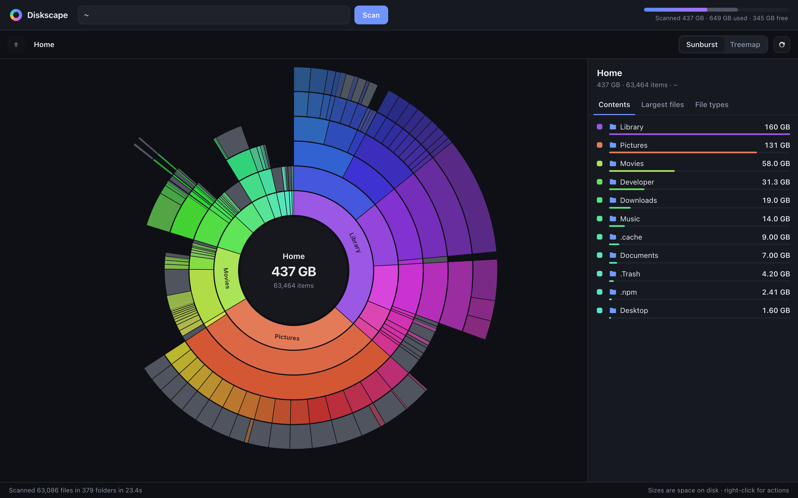
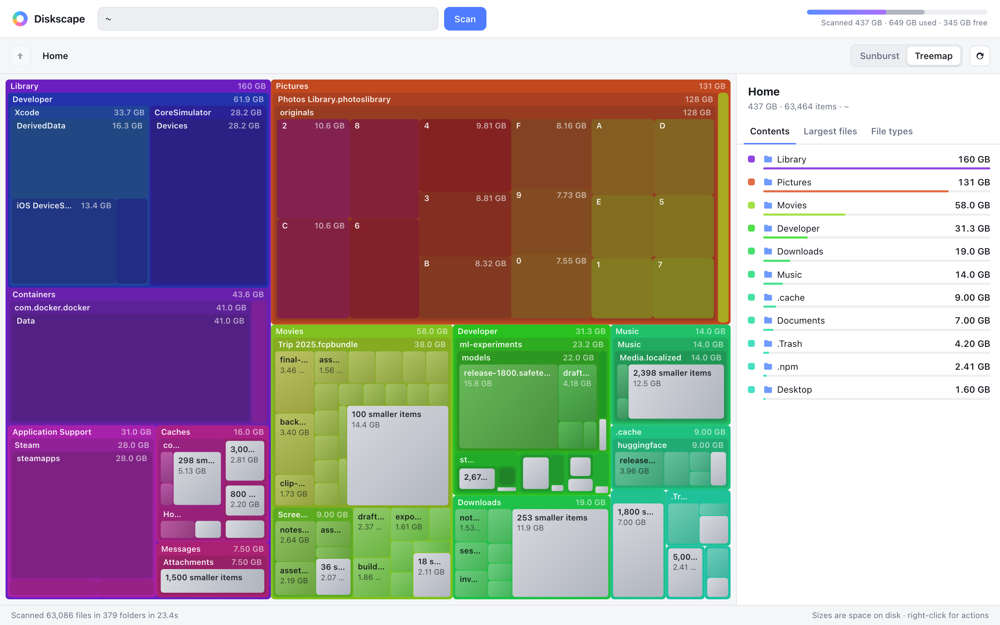

# Diskscape

**Find out what's filling your Mac's disk, with no dependencies.**

Diskscape scans a disk or folder and shows the result as an interactive sunburst or treemap in your browser. It is one small Python package that uses only the standard library, plus a hand-written canvas UI. You don't need npm, Electron or an App Store download, and nothing leaves your machine.



<details>
<summary>Treemap view (light mode)</summary>


</details>

## Features

- **Fast scanning.** A thread pool reads roughly 50,000 files a second on an SSD, with live progress.
- **Two views.** A *sunburst* and a squarified *treemap*. Both colour each folder and its contents as one family, and zoom smoothly as you drill in.
- **Side panel.**
  - **Contents** of the current folder.
  - **Largest files** anywhere below it.
  - **File types**, grouped into video, images, archives, code and so on, then by extension.
- **Act on what you find.** Right-click any item to **Reveal in Finder** or **Move to Trash**. Trashing goes through Finder, so *Put Back* still works.
- **Accurate sizes.**
  - Counts the space actually allocated on disk, so sparse files count only what they use.
  - Counts hard links once and doesn't follow symlinks.
  - Doesn't double count APFS firmlinks when you scan `/`.
- **Light and dark mode** follow your system setting.

## Requirements

- macOS with Python 3.9 or later. The `python3` that comes with the Xcode Command Line Tools is enough.
- Any modern browser.

Scanning and browsing also work on Linux. *Reveal* and *Trash* are macOS-only.

## Usage

Run it straight from a clone, with no install:

```sh
git clone https://github.com/<you>/diskscape.git
cd diskscape
python3 -m diskscape            # start screen: pick a disk or folder
python3 -m diskscape ~          # scan your home folder straight away
```

Or install it as a command with [pipx](https://pipx.pypa.io/):

```sh
pipx install git+https://github.com/<you>/diskscape.git
diskscape ~/Library
```

Options:

| Option          | Meaning                                                    |
| --------------- | ---------------------------------------------------------- |
| `PATH`          | Folder to scan straight away (default: show start screen)  |
| `--port N`      | Port to listen on (default `8765`, or the next free one)   |
| `--no-browser`  | Print the URL instead of opening a browser                 |
| `--idle-timeout MIN` | Stop after `MIN` minutes of inactivity (default `15`, `0` = never) |
| `--version`     | Print the version and exit                                 |

### Controls

| Action                       | How                                                |
| ---------------------------- | -------------------------------------------------- |
| Open a folder                | Click it in the chart or the list                  |
| Go up                        | `Esc`, `Backspace`, the centre circle, or ↑        |
| Switch view                  | `s` (sunburst) / `t` (treemap)                     |
| Reveal in Finder / Trash     | Right-click, or hover a row in the list            |

### Idle shutdown

Diskscape stops itself after 15 minutes without activity, so it doesn't sit in the background forever. Activity means using the page (moving the mouse, scrolling, typing). A browser tab you've left open doesn't count. A running scan never times out, and the timer restarts when the scan finishes. If the server has stopped, the page tells you; run the command again to start a new session.

### Protected folders

macOS hides some folders (Mail, Messages, Safari, other apps' containers) from apps that lack **Full Disk Access**. Diskscape reports how many items it couldn't read. To include them, grant your terminal app Full Disk Access in **System Settings › Privacy & Security › Full Disk Access**, then rescan.

## Security

Diskscape runs a small HTTP server so the browser can talk to the scanner. It is locked down:

- It listens on `127.0.0.1` only, never on your network.
- Every API request needs a random token that is created at startup and passed in the URL, so other websites in your browser can't call it.
- It checks the `Host` header, which blocks DNS-rebinding attacks.
- *Reveal* and *Trash* only accept paths inside the folder you scanned, and never the scanned folder itself.
- Before acting, Diskscape re-checks the path on disk, walking down from the scanned folder without following symlinks. It refuses if a folder on the way has been swapped for a symlink, if the item has changed type, or if the item is itself a symlink.
- The scanner opens each folder by handle and checks it is the same folder it saw listed, so a folder swapped for a symlink mid-scan can't lead it outside the folder you chose.
- Trash always asks for confirmation and goes through Finder, so *Put Back* works.

**Known limitation:** Finder can only be given a path, not a handle. Someone able to modify the scanned folder at the exact moment you trash something could swap an item between Diskscape's check and Finder's move. Diskscape then confirms the item that landed in the Trash is the one it checked. If it isn't, it reports this instead of updating the view. The wrong item would be in the Trash, where *Put Back* restores it, not deleted. Closing this gap fully would mean moving items without Finder, which loses *Put Back*.

## How it works

```
diskscape/
  scanner.py     threaded os.scandir walk -> compact in-memory tree, queries
  server.py      http.server JSON API + static files, CLI entry point
  static/        index.html, style.css, app.js (canvas sunburst + treemap)
tests/           unittest suites for the scanner and the HTTP API
```

The scanner keeps one small object per folder and a `(name, bytes)` tuple per file. After the walk, it adds up sizes in a single bottom-up pass. The UI then asks for just the part of the tree it is showing: about six levels deep, with anything under 0.1% folded into "N smaller items". This keeps responses small even for millions of files.

## Development

There is nothing to install.

```sh
python3 -m unittest -v               # run the tests
python3 -m diskscape --no-browser .  # run against this repo
```

The front end is plain JavaScript with no build step. Edit `diskscape/static/*` and reload the page.

## License

[MIT](LICENSE)
